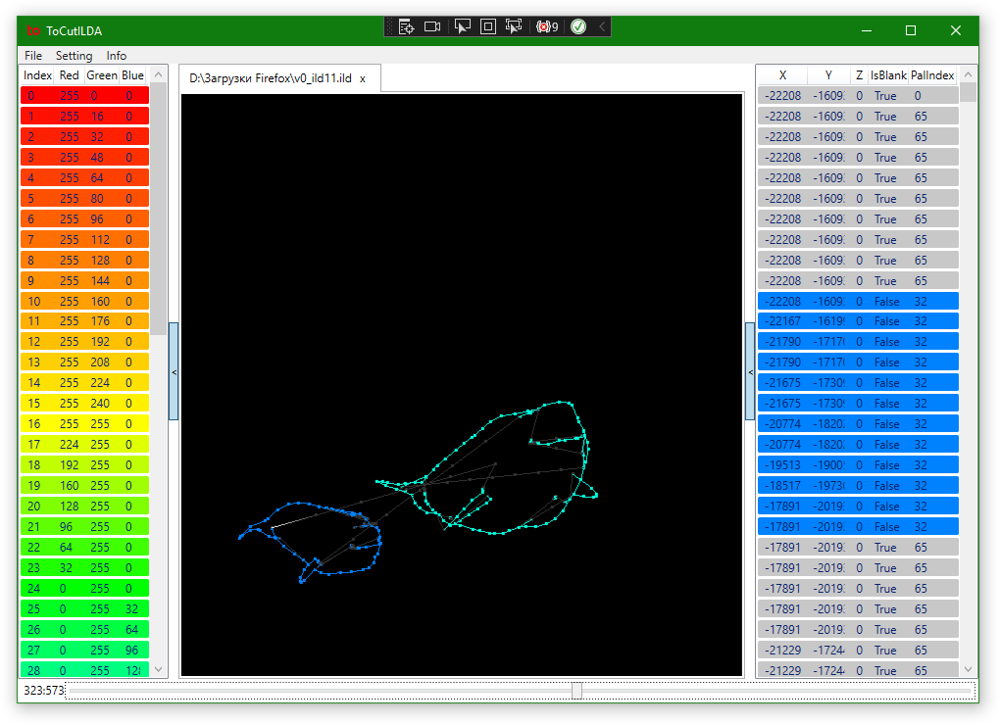

# ILDAViewer.net

This is the ILDA (International Laser Display Association) viewer.

This project used [OpenTK](https://github.com/opentk/opentk) and [ILDA.net](https://github.com/urbaraban/ILDA.net).

